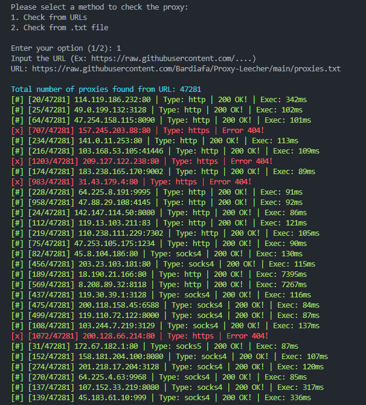

# 🕵️‍♂️ Proxy Checker

# Preview

## 🚀 Using Vscode
1. git clone https://github.com/mza-xxdv/proxy-checker.git
2. pip install -r requirements.txt
3. cd proxy-checker
4. python proxy-checker.py

## 🚀 Using Termux
Termux - Android (recommended version 0.117 - last)

https://apkcombo.com/id/termux/com.termux/old-versions/0.119.1/

1. pkg upgrade && pkg update
2. pkg install git
3. pkg install python
4. pkg install python-pip
6. termux-setup-storage
7. cd /storage/emulated/0
8. git clone https://github.com/mza-xxdv/proxy-checker.git
9. cd proxy-checker
9. ls
10. pip install -r requirements.txt
11. python v1/v2.py

## For Update
git pull

## Addition
For live proxies, check the file 'proxy-live.txt' or 'proxy-only.txt'

The module is included, but if there isn't a module installed, you can install it manually

pip install "module name" ---> remove the quotes

## Author
@mza-xxdv
